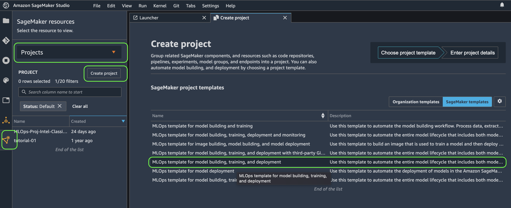
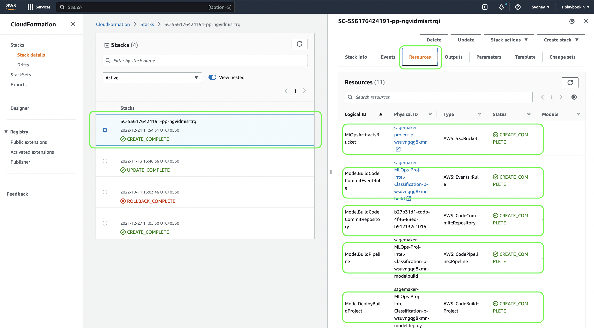
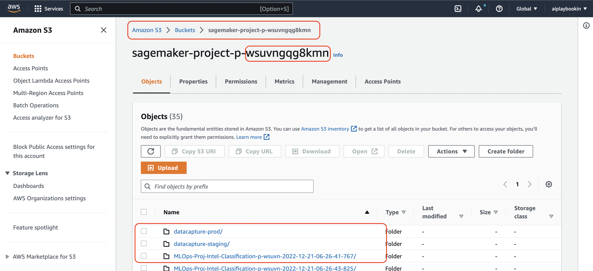
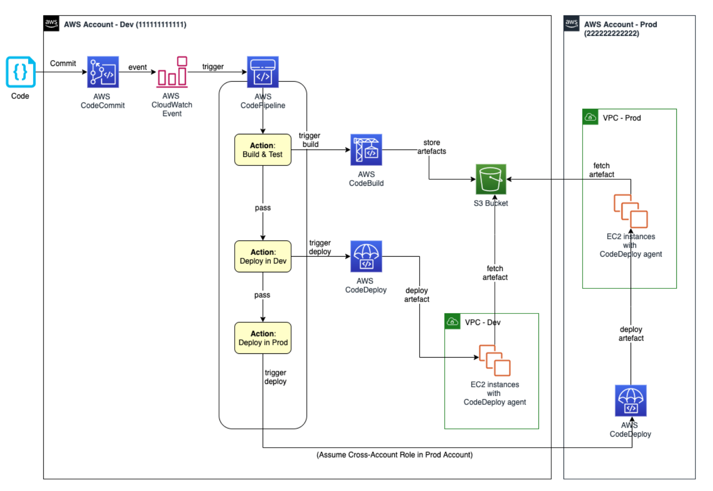
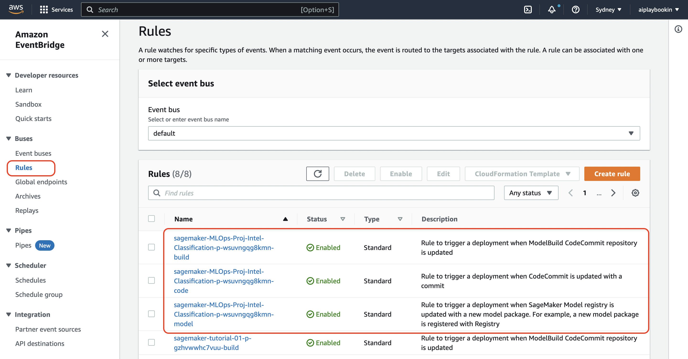

# Image Classification using AWS CICD Template

We would be using all AWS Services
- AWS Codecommit
- AWS Cloud Formation
- Sagemaker Studio

### 1. Create Project 


Fill the project name and proceed.

In background, it will create a ```Cloud Formation``` template start its execution automatically.

### 2. Cloud Formation 

Toolchain template which provides the resources needed to represent ```infrastructure as code```. This template specifically creates a CI/CD pipeline to build a model using a SageMaker Pipeline and deploy the resulting trained ML Model from Model Registry to two stages in CD -- staging and production.

**Resources associated which are created**
- S3 bucket
- CodeCommit repo
- CodePipeline
- Event Bridge Rules
- CodeBuild



A unique Project id is created. S3 bucket is created with sub folders.



**CodeBuild**

AWS CodeBuild is a service that allows you to run and build your code. It is similar to GitHub Actions in that it can automatically build and test your code, but it is a separate service provided by Amazon Web Services (AWS). With CodeBuild, you can use a buildspec file to specify how your code should be built and tested. This file can include instructions for installing dependencies, running tests, and generating a deployable package.

**CodePipeline**
AWS CodePipeline is a service that helps you automate the process of releasing your software. It allows you to define a series of stages that your code will go through on its way to production, such as building, testing, and deploying. CodePipeline can automatically run these stages and move your code from one stage to the next based on the results of the previous stage.

For example, if your code passes the testing stage, CodePipeline will automatically move it to the deployment stage. This can help you release your software faster and more reliably, because you don't have to manually run each stage of the process.

*CodeBuild is focused on building and testing code, while CodePipeline is focused on automating the process of releasing software.* They can be used together as part of a continuous integration and continuous deployment (CI/CD) pipeline, but they serve different purposes.

Example CI/CD with AWS CodeBuild, CodePipeline, CodeCommit, CodeDeploy (not the one here in repo, but similar)



**Event Bridge**
Amazon EventBridge is a service that allows you to connect your applications and services so they can share data and events. With EventBridge, you can create rules that determine which events your applications and services should receive.

For example, you could create a rule that says when a specific event occurs in one of your applications, it should be sent to another application or service for further processing. This allows you to automate the flow of data and events between your applications and services, which can make it easier to build and manage complex systems.

SageMaker Project Event Bridge Rules




SM_OTPUT_DIR : Anything which is saved here gets saved in model dir in S3.